# The Manual of Enfuzzer

Enfuzzer is the first tool for ensemble fuzzing, which effectively improves the performance and generalization ability of each base fuzzers.
Enfuzzer can be used for free in：http://wingtecher.com/Enfuzz.

## Instructions of Enfuzzer

The use of Enfuzzer can be mainly divided into 5 steps：
1. environment setting; 2. upload source code and build; 3.upload inital seeds; 4.base fuzzers selection; 5.run Enfuzzer.

###  Step One: environment setting

The screenshot of the user interface is shown below:

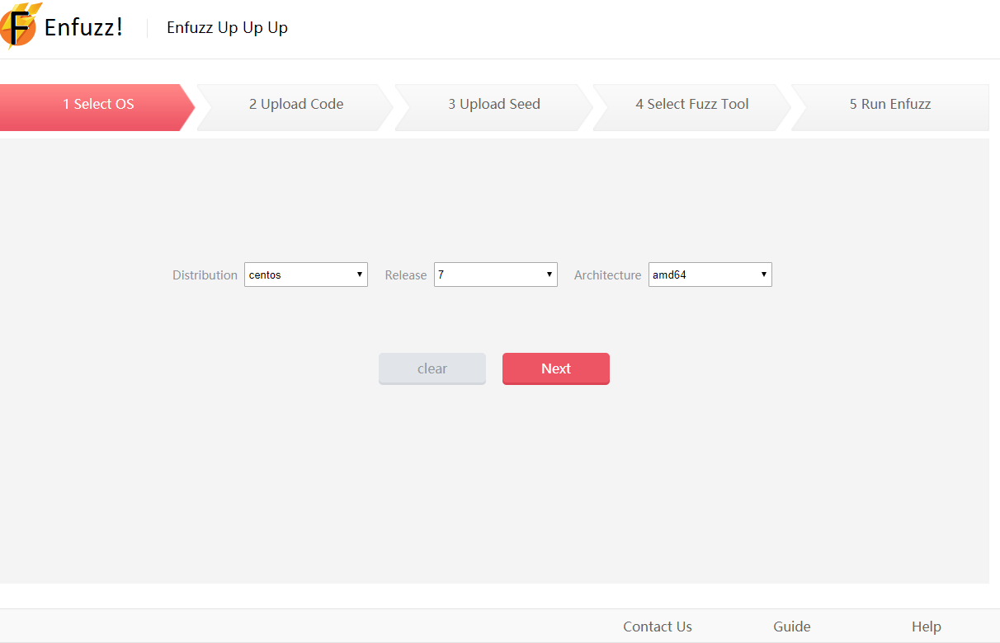

To improve the compatibility and robustness of Enfuzzer,  we design and implement a runtime layer, which contains shared libraries used by upper layers. This enables compatibility across Linux distributions.
The main Linux distributions are included, such as alpine, archlinux, centos, debian, fedora, gentoo, opensuse, oracle, plamo and ubuntu.
In addition to, Ubuntu, archlinux, centos, debian, gentoo, fedora and opensuse are tested.(As of 2018-10-01)

After the user selects the operating system of the target application and clicks the Next button, the Enfuzz server will automatically build the system environment. The automated build process information will be displayed in the user interface in real time. After the environment setting process is successful, the interface will automatically redirect to the next step.

### Step Two: upload and build source code

The screenshot of the user interface is shown below:

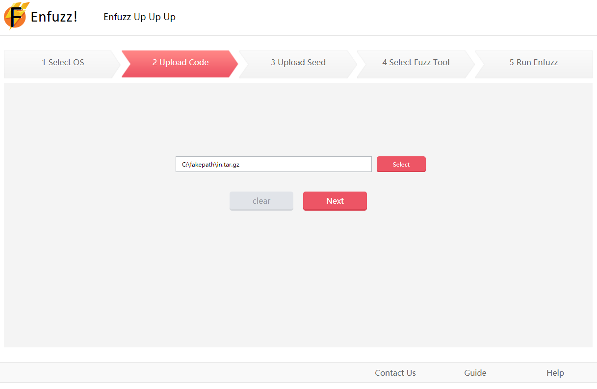

After user chooses to package and upload the source code, fuzzing driver interface and fuzzing build script of target application.(currently tar.gz and zip are supported) The Enfuzz Server will automatically run the fuzzing build script to complie and instrument the sorce code and fuzzing driver interface of target application. Then automatically link them together. The detail information of building process will be displayed in the user interface in real time. After the target application is complied, the user interface will automatically redirect to the next step.

Currently, three mian compliation precesses are supported: cmake, Make and autotools.

#### example 1: cmake for libssh（take Ubuntu for example）:

The file directory of the libssh is as follows:

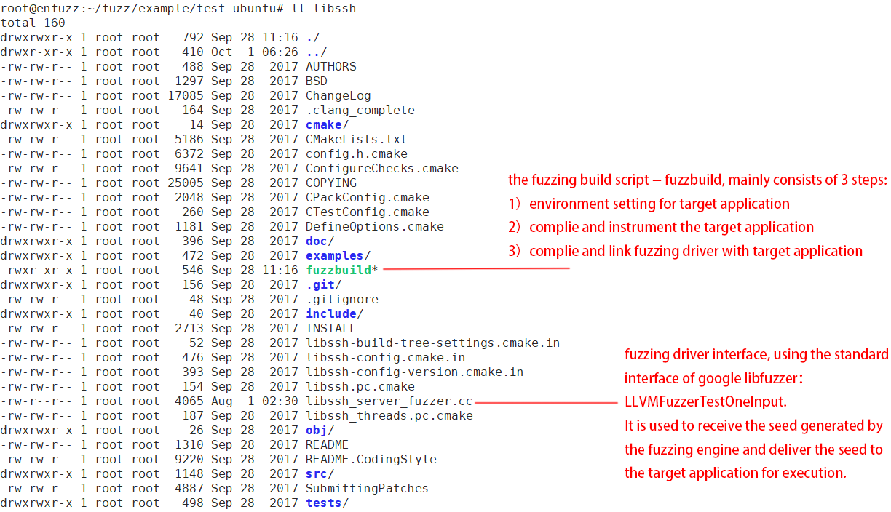

In this file directory, in addition to the original file of the libssh, the user only needs to construct two more files:

1. the fuzzing build script -- fuzzbuild, mainly consists of 3 steps:
	1）environment setting for target application
	2）complie and instrument the target application
	3）complie and link fuzzing driver with target application
	
   The details of the automated build script fuzzbuild are shown below:

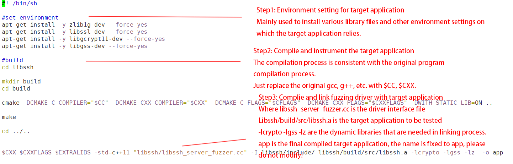

2. fuzzing driver interface, using the standard interface of google libfuzzer：LLVMFuzzerTestOneInput. 
It is used to receive the seed generated by the fuzzing engine and deliver the seed to the target application for execution.

   The details of the fuzzing driver interface file libssh_server_fuzzer.cc are shown below:

#### example 2: Make for re2（take Ubuntu for example）:

The file directory of the re2 is as follows:

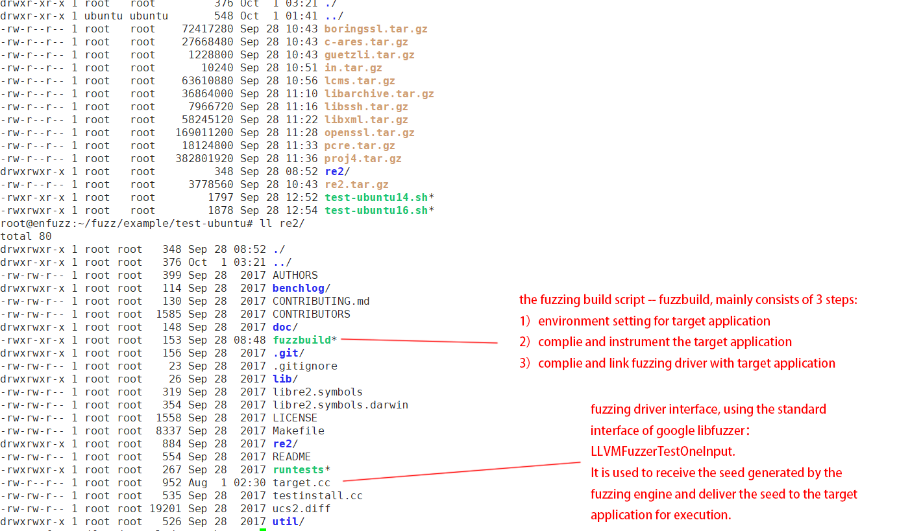

In this file directory, in addition to the original file of the re2, the user only needs to construct two more files:

1. the fuzzing build script -- fuzzbuild, mainly consists of 3 steps:
	1）environment setting for target application
	2）complie and instrument the target application
	3）complie and link fuzzing driver with target application
	
   The details of the automated build script fuzzbuild are shown below:

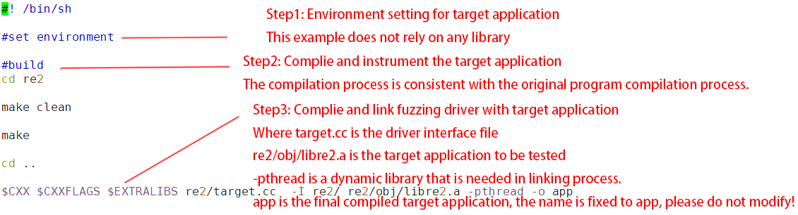

2. fuzzing driver interface, using the standard interface of google libfuzzer：LLVMFuzzerTestOneInput. 
It is used to receive the seed generated by the fuzzing engine and deliver the seed to the target application for execution.

   The details of the fuzzing driver interface file target.cc are shown below:

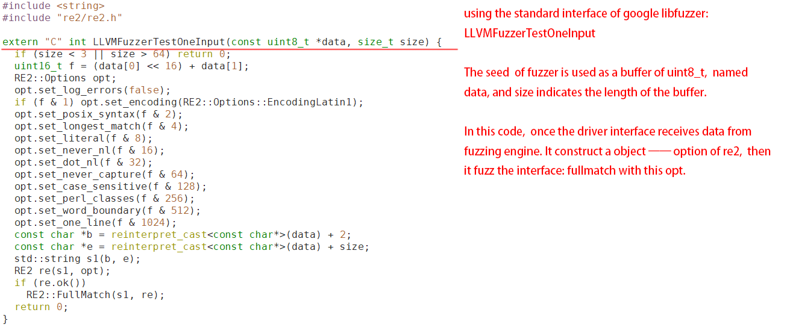

#### example 3: autotools for pcre（take Ubuntu for example）: 

The file directory of the pcre is as follows:

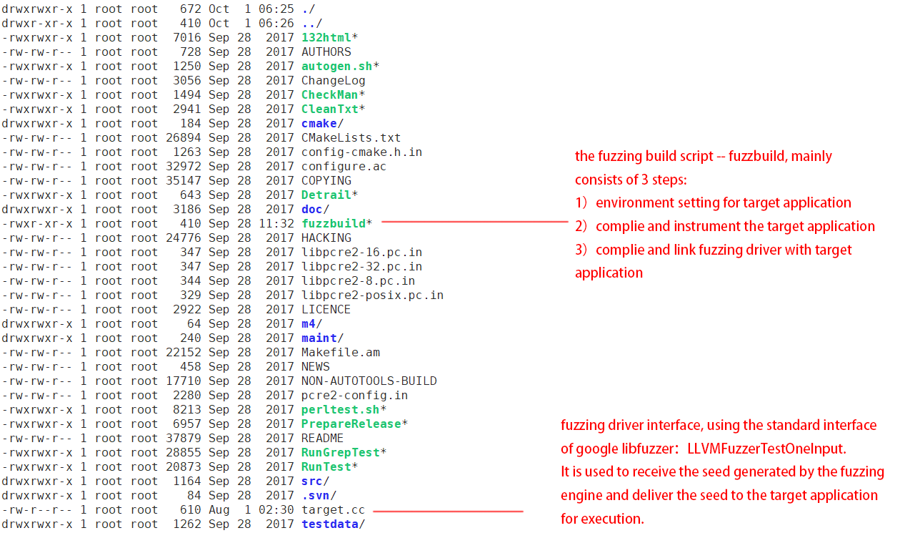

In this file directory, in addition to the original file of the pcre, the user only needs to construct two more files:

1. the fuzzing build script -- fuzzbuild, mainly consists of 3 steps:
	1）environment setting for target application
	2）complie and instrument the target application
	3）complie and link fuzzing driver with target application
	
   The details of the automated build script fuzzbuild are shown below:

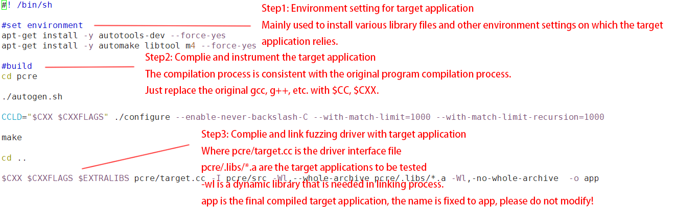

2. fuzzing driver interface, using the standard interface of google libfuzzer：LLVMFuzzerTestOneInput. 
It is used to receive the seed generated by the fuzzing engine and deliver the seed to the target application for execution.

   The details of the fuzzing driver interface file target.cc are shown below:

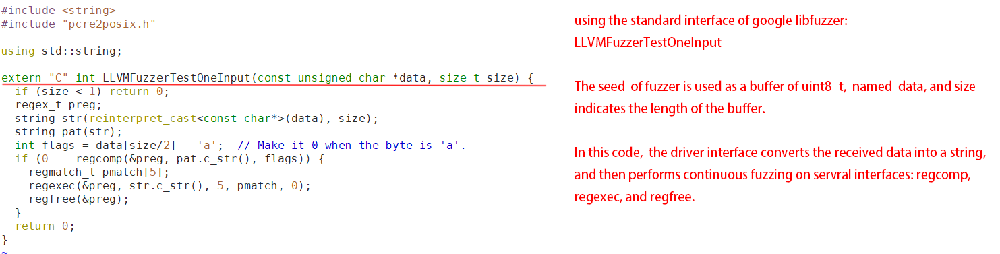

### Step Three: upload initial seeds

The screenshot of the user interface is shown below:

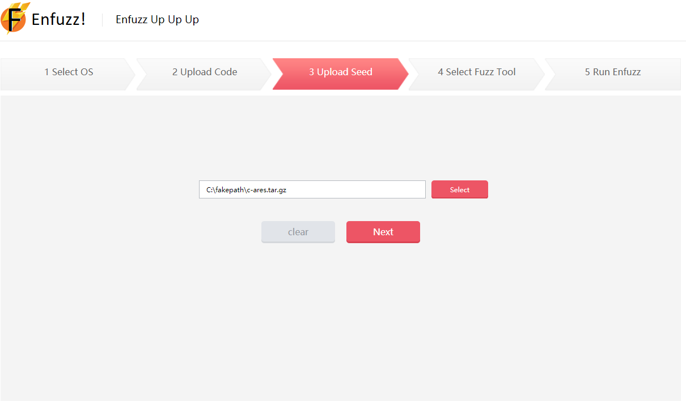

The initial seed has a great impact on the performance of the fuzzing testing. The user can choose to package and upload the initial seed of the target application (currently tar.gz and zip are supported). The Enfuzz Server will automatically unpack the initial seed. After the seed is ready, the interface will automatically redirect to the next step.

### Step Four: base fuzzer selection

The screenshot of the user interface is shown below:

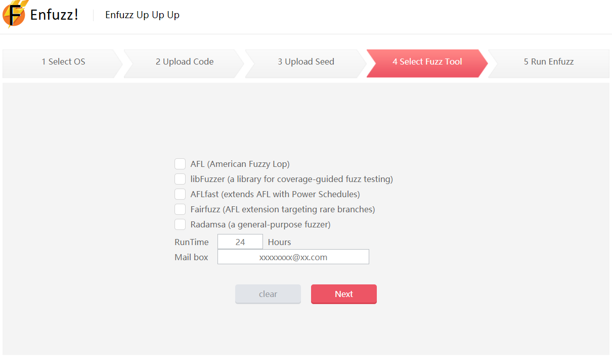

The core idea of Enfuzzer is to ensemble different kinds of base fuzzers as diverse as possible. Currently, basing on bitmap, mutation-based fuzzers -- AFL, AFLFasts and FairFuzz; basing on various sanitizers, mutation-based fuzzer -- libFuzzer; as well as generation-based fuzzer -- Radamsa. More base fuzzers will be included later.

After the user selects the base fuzzers and fuzzing time, click the next button.
The Enfuzz Server will automatically record the parameters selected by the user. After the fuzzing process is ready, the interface will automatically redirect to the next step.

### Step Five: run Enfuzzer

The screenshot of the user interface is shown below:

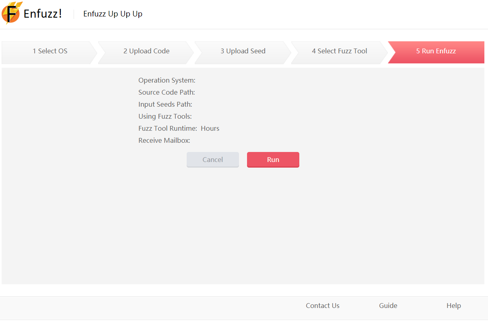

After confirming the basic fuzzing information, the user chooses to execute the Enfuzzer service. The Enfuzz server will automatically fuzz target application through ensemble method. The basic information of the fuzzing process (path coverage information and unique crashes information) will be displayed in the interface in real time. When Enfuzzer is finished, the server will automatically send an email to the user's mailbox.

## Q&A：

Question 1：Can not found fuzzbuild in Step Two.

Answer 1：1)Check if the folder name is XXX after unpacking XXX.tar.gz/xxx.zip;
	  2)Check if the fuzzbuild script is included in the XXX folder.
	  3)Check the execution permission of the fuzzbuild file.
